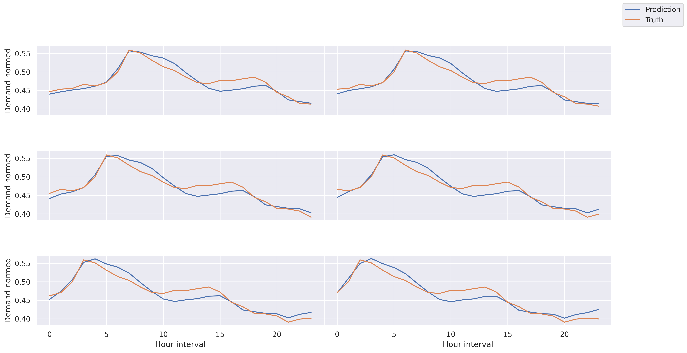
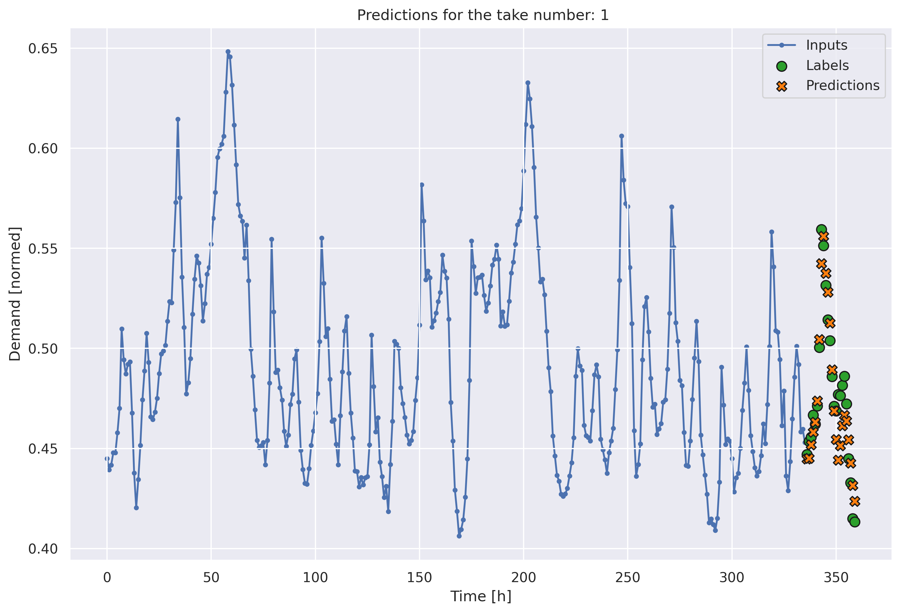

## ForHeat

ForHeat is standing for 'Forecasting Heat Demand' and is a Python library for heat demand uncertainties. This repository contains code for time series forecasting using LSTM encoder-decoder models implemented in TensorFlow/Keras. The models are designed to predict future values based on historical observations.

## Installation

The installation is not implemented yet since there is no release. However you can access the code via

```bash
git clone git@github.com:AminDar/HeatForecast.git
```

## Overview

The project includes the following main components:

* Model Architecture: Implementation of LSTM encoder-decoder models for time series forecasting. Two variants of the model architecture are provided: one with a single dense layer and another with multiple dense layers.


*  Training: Scripts for training the models on provided time series data. Training includes defining the model architecture, compiling the model with appropriate loss and optimization functions, and fitting the model to the training data.


*  Evaluation: Evaluation of trained models on test data, including computation of evaluation metrics such as mean squared error (MSE), mean absolute error (MAE), root mean squared error (RMSE), and mean absolute percentage error (MAPE).


*  Visualization: Visualization of model predictions compared to ground truth values, allowing for easy interpretation of model performance.





## Prerequisites

Before running the code, ensure you have the following dependencies installed:

    Python 3.x
    TensorFlow
    Keras
    pandas
    numpy
    matplotlib
    seaborn
    scikit-learn

You can install the required packages using pip:
```bash
pip install -r requirements.txt
```

## Usage

*  Data Preparation: Ensure your time series data is organized and preprocessed appropriately. The **Demand** column is supposed to be the first column. Before training the models, prepare your time series data by organizing it into appropriate train, validation, and test sets. You can use functions like split_data to split the data, and norm_data to normalize the data.
```bash
# Example of splitting data and normalization
train_dfs, test_dfs, val_dfs = split_data(df)
df_norm_train, df_norm_test, df_norm_val, scaler = norm_data(
    train_dfs,
    test_dfs,
    val_dfs,
    mm,
    normalize_all_features=False,
    columns_to_normalize=normalized_x)

```
*  Model Configuration:
Choose the appropriate model architecture (single dense layer or multiple dense layers) and configure the hyperparameters such as the number of LSTM units, learning rate, and loss function.

```
# Define model architecture and hyperparameters
model, encoder_model, decoder_model = define_models_dense(input_shape, output_shape)

```
*  Training:
Train the model using the prepared datasets. Monitor the training process using TensorBoard logs and checkpoints to track progress and save the best model weights.
```
# Compile and train the model
model.compile(optimizer=optimizer,
              loss=loss_fun,
              metrics=['mse', tf.keras.metrics.MeanAbsoluteError(), 
                       tf.keras.metrics.RootMeanSquaredError(),
                       tf.keras.metrics.MeanAbsolutePercentageError()])
history = model.fit(windowed_train, epochs=nEpoch, validation_data=windowed_val, verbose=True,
                    shuffle=False, callbacks=callbacks_list)
```

*  valuation:
Evaluate the trained models on the test set to assess their performance. Compute evaluation metrics such as mean squared error (MSE), mean absolute error (MAE), root mean squared error (RMSE), and mean absolute percentage error (MAPE).
```
# Evaluate the model on test data
model.evaluate(windowed_test)
```
*  Visualization:
Visualize model predictions compared to ground truth values to interpret model performance effectively.
```
# Visualize predictions
for data in windowed_test.take(take):
    (past, future), truth = data
    predictions = model.predict([past, future])
    Window_Gen.plot(past, truth, take, predictions)
```
## Example




The above picture shows the predictions for 24h ahead using 2 weeks historical data.

## File Structure

The repository has the following structure:

*  models.py: Contains the definitions of the LSTM encoder-decoder models.
*  train.py: Script for training the models on provided data.
*  evaluate.py: Script for evaluating trained models on test data.
*  visualization.py: Script for visualizing model predictions and evaluation metrics.
*  data/: Directory containing sample time series data for demonstration purposes.
*  logs/: Directory for storing TensorBoard logs during training.
*  weights/: Directory for saving trained model weights and other artifacts.

## References

[GitHub Repository](https://github.com/AminDar/HeatForecast)

## Contributors

[Amin Darbandi](amin.darbandi@aol.com)

## License

This project is licensed under the [MIT](https://choosealicense.com/licenses/mit/) License - see the LICENSE file for details.

## Contributing

Pull requests are welcome. For major changes, please open an issue first
to discuss what you would like to change.

Please make sure to update tests as appropriate.
